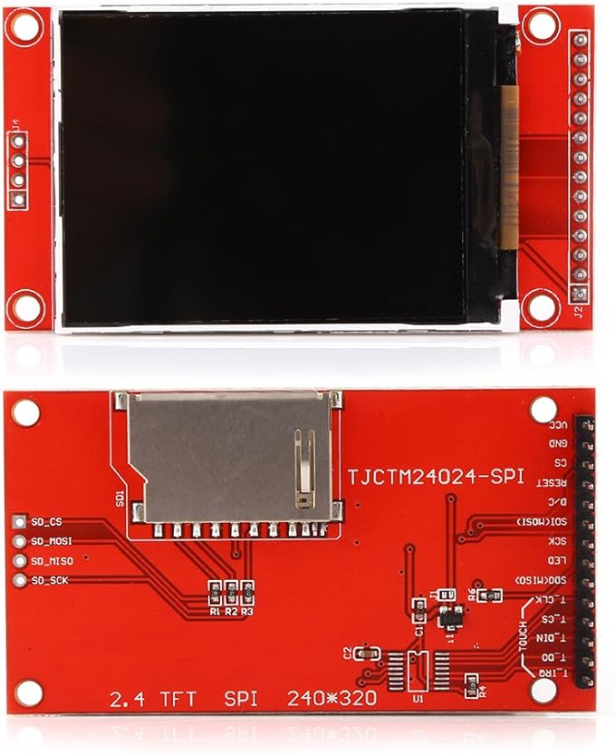

# ILI9341 SPI TFT Display/Raspberry Pi Pico Example

Demonstration code for using a Raspberry Pi Pico with common TFT SPI boards.

I have it set up with the pin-out of the version that comes on a cheap
[Pico Breadboard Kit](https://github.com/geeekpi/picoBDK).

| Pin | SPI         |
| --- | ----------- |
| 6   | SCK/CLK     |
| 7   | MOSI/SDI/TX |
| 4   | MISO/SDO    |
| 13  | CS          |
| 14  | RST         |
| 15  | DC          |

I used Vlad Tomoiagă's [library](https://github.com/tvlad1234/pico-displayDrivs). It requires `LCD_setPins(15, 13, 14, 6, 7)`.

For `LCD_setRotation` assuming the top of the screen is the top of the board,

| Value | Result                     |
| ----- | -------------------------- |
| 0     | Top is right side of board |
| 1     | Upside down                |
| 2     | Top is left side of board  |
| 3     | Rightside up               |
